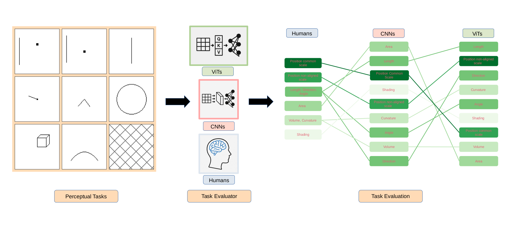

# ViTsGraphicalPerception [](http://www.replicabilitystamp.org#https-github-com-poonam2308-vitsgraphicalperception)
[DOI](https://doi.org/10.1016/j.cag.2025.104458)




**Evaluating graphical perception capabilities of Vision Transformers**  
Vision Transformers (ViTs) have emerged as a powerful alternative to convolutional
neural networks (CNNs) in a variety of image-based tasks. While CNNs have pre-
viously been evaluated for their ability to perform graphical perception tasks, which
are essential for interpreting visualizations, the perceptual capabilities of ViTs remain
largely unexplored. In this work, we investigate the performance of ViTs in elementary
visual judgment tasks inspired by Cleveland and McGill’s foundational studies, which
quantified the accuracy of human perception across different visual encodings. Inspired
by their study, we benchmark ViTs against CNNs and human participants in a series of
controlled graphical perception tasks. Our results reveal that, although ViTs demonstrate
strong performance in general vision tasks, their alignment with human-like graphical
perception in the visualization domain is limited. This study highlights key perceptual
gaps and points to important considerations for the application of ViTs in visualization
systems and graphical perceptual modeling.

##  Repository structure
The src directory contains the code necessary to produce the data, train the models for all results reported in the paper.


### Installation 

#### Requirements Summary 
- Python >= 3.10
- Cuda >= 12.4
- Pytorch: 2.6.0

If you  want to avoid option 1  manual installation, perform the following:
```bash
git clone https://github.com/poonam2308/ViTsGraphicalPerception.git
cd ViTsGraphicalPerception
bash install_replicate.sh
```
#### Prerequisites

```bash
sudo apt update
sudo apt install git 
```
Installation of all the requirements can be either done manually or using conda option.For instructions on installing Conda, see [prerequisites.md](prerequisites.md).

### Option 1: Conda
Before proceeding ensure that Conda is installed on your system, see [prerequisites.md](prerequisites.md).
#### Clone and set up conda evnvironment
```bash
#git clone git@github.com:poonam2308/ViTsGraphicalPerception.git 
# to avoid SSH key issues  perform git clone via https instead of SSH
git clone https://github.com/poonam2308/ViTsGraphicalPerception.git
cd ViTsGraphicalPerception
bash setup_conda.sh
#*Note* If you did not accept the license terms during the first Miniconda installation attempt, the installer will prompt you again to review and accept the terms.
conda activate vitsgp
```

### Option 2. Virtualenv + pip
on a fresh machine, you can install the basic  python tools with (do not forget to replace X with the python version in your machine):
```bash
sudo apt python3 python3-venv python3-pip
# if python version specific, replace X in the below comment and run the below command
#sudo apt install python3.X python3.X-venv python3-pip
```

#### Clone and set up a virtual environment
```bash
#git clone git@github.com:poonam2308/ViTsGraphicalPerception.git 
# to avoid SSH key issues  perform git clone via https instead of SSH
git clone https://github.com/poonam2308/ViTsGraphicalPerception.git
cd ViTsGraphicalPerception
bash setup_venv.sh
source venv/bin/activate
```

### How it works 
- Stimulus Generation (Data): [src/ClevelandMcGill](src/ClevelandMcGill) modules to build task specific images 
- Network: [src/Models](src/Models) modules to define the three types (CvT, Swin, vViT) network architecture used in the paper
- Training: [src/Experiments](src/Experiments) modules to perform training on CvT, Swin and vViT on generated data. Please note *data* is generated during the training process and it is not saved in the disk. It can be easily produced with the stimuli generation step. 
- Evaluation: [src/TestEvaluation](src/TestEvaluation) modules to evaluate the trained checkpoints (weights) on the test dataset. 
- Analysis: [src/Analysis](src/Analysis) modules to compare CvT, Swin, and vViT to human performance on the same synthetic stimuli.

#### Pretrained Weights
The trained checkpoints for the experiments are available on GoogleDrive
Access it [here](https://drive.google.com/drive/folders/16w2oXF3nrA5wI-i6CxIxIX73Z7Pf6qWF?usp=drive_link)


### Run Experiments

1. **Create required folders**

```bash
   mkdir -p src/Experiments/chkpt
   mkdir -p src/Experiments/trainingplots
```

2. **Train a model (per task/script)**

```bash
   python src/Experiments/<name_of_file>.py
```
3. **Customize data sizes, batch size, epochs**
All experiment scripts accept the following flags:

--train_target <int> number of training samples

--val_target <int> number of validation samples

--test_target <int> number of test samples

--batch_size <int> batch size

--epochs <int> number of training epochs

```bash
  python src/Experiments/cvt_bfr.py --train_target 100 --val_target 20 --test_target 20 --batch_size 32  --epochs 100
```


##  Evaluation and Analysis
Reproduce the following via single scripts

**Analysis figures Run the analysis scripts directly**

1. Navigate to the directory [src/Analysis](src/Analysis)
2. Open and run:

```bash
jupyter notebook Analysis.ipynb
```

**Baseline evaluation (all models via one single script notebook)**
1. Navigate to the directory [src/TestEvaluation](src/TestEvaluation) 
  Download the pretrained checkpoints and place them in:

```bash
TestEvaluation/chkpt/
```
2. Open and run:

```bash
jupyter notebook Main_Evaluation.ipynb
```

All evaluation results are saved as CSV files under the  results/ subfolders.


**Ablation study (all models via one single script notebook)**
1. Navigate to the directory [src/TestEvaluation](src/TestEvaluation) 
  Download the pretrained checkpoints and place them in:
```bash
TestEvaluation/chkpt/
```

2. Open and run:

```bash
jupyter notebook Ablation_Evaluation.ipynb
```

### Replicability
#### Environment and Hardware
- **OS tested** Linux (Pop!_OS, Arch)
- **Python / CUDA:** [Python 3.10], [CUDA 12.4], [PyTorch 2.3] 
- **GPU used:** [NVIDIA RTX 3090], [NVIDIA RTX 6000 Ada], [NVIDIA A100]
- **VRAM required (training):** [≥ 16 GB VRAM recommended] 
- **VRAM required (evaluation only):** [≥ 12 GB VRAM]
- **Typical training one model & task:** [~4.0 to 6 hours] for `[epochs=100, batch_size=32]` on the GPU above.  
  *Note:* Data are generated on the fly during training as described in the repo. If you have less *VRAM(smaller GPUs)*, reduce batch_size. Evaluation typically fits in ~12 GB VRAM. Random seeds are set in the experiment scripts; small numeric differences may occur across hardware/driver versions.
- Produce evaluation results with `Main_Evaluation.ipynb` and analysis figures with `Analysis.ipynb`.
- Or run both in one go with the convenience script; this script here is *reproducing the results and figures from the paper using the provided pretrained checkpoints, not re-training models from scratch*:
```bash
replicate.sh
```
